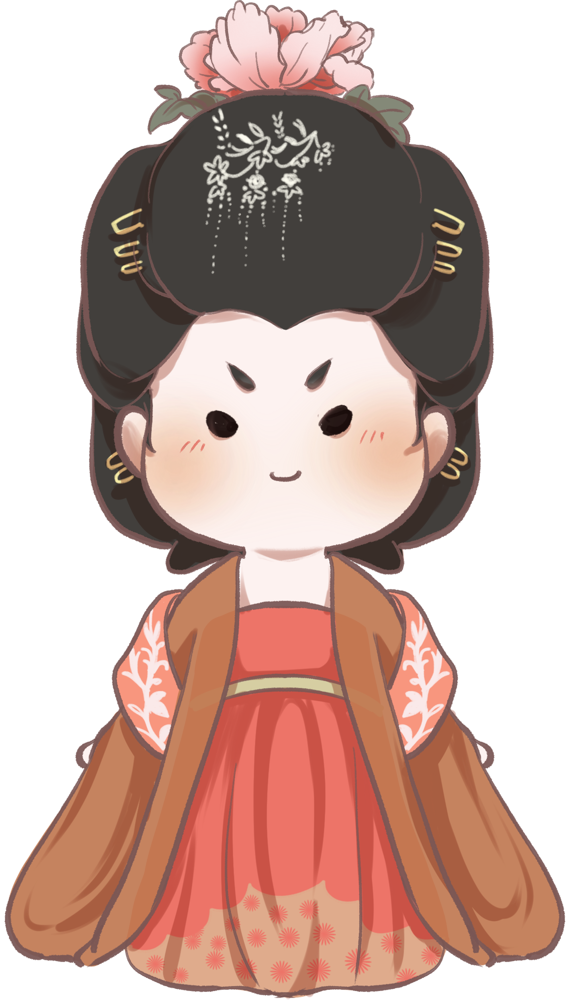
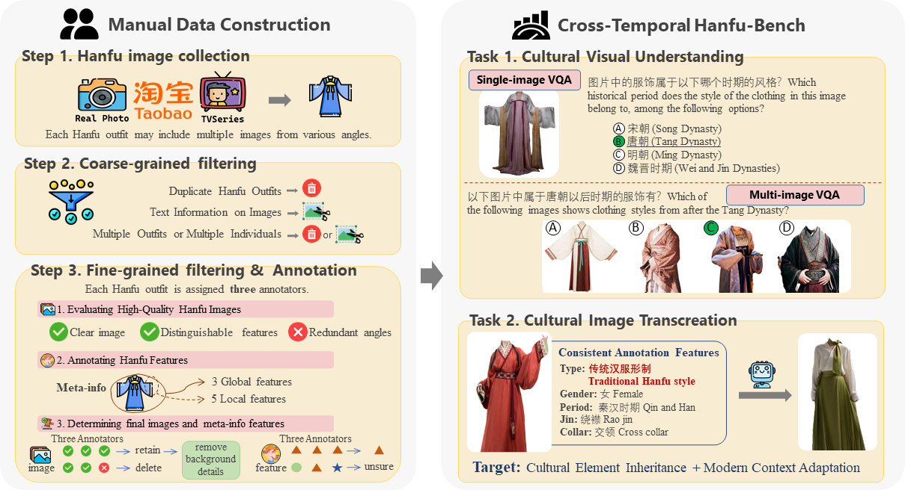

#  Hanfu-Bench: A Multimodal Benchmark on Cross-Temporal Cultural Understanding and Transcreation

<div align="center">
<a href="https://arxiv.org/pdf/2506.01565v1" target="_blank"></a>
<a href="https://huggingface.co/datasets/lizhou21/Hanfu-Bench" target="_blank"></a>
</div>

## Overview
We introduce Hanfu-Bench, a novel, expert-curated multimodal dataset. Hanfu, a traditional garment spanning ancient Chinese dynasties, serves as a representative cultural heritage that reflects the profound temporal aspects of Chinese culture while remaining highly popular in Chinese contemporary society. Hanfu-Bench comprises two core tasks: cultural visual understanding and cultural image transcreation. The former task examines temporal-cultural feature recognition based on single- or multi-image inputs through multiple-choice visual question answering, while the latter focuses on transforming traditional attire into modern designs through cultural element inheritance and modern context adaptation. Our evaluation shows that closed VLMs perform comparably to non-experts on visual cutural understanding but fall short by 10% to human experts, while open VLMs lags further behind non-experts. For the transcreation task, multi-faceted human evaluation indicates that the best-performing model achieves a success rate of only 42%. Our benchmark provides an essential testbed, revealing significant challenges in this new direction of temporal cultural understanding and creative adaptation.
<p align="center">
  
</p>

## Getting Started
### Installation
```sh
pip install -r requirements.txt
```

### Examples
meta-info.json
```
Dataset({
  "1000": {
    "source": "TaoBao",
    "img_list": [
      "num1000_img1.jpg"
    ],
    "gender": "female",
    "type": "传统汉服形制",
    "period": "唐朝",
    "xiu": "unsure",
    "jin": "对襟",
    "ling": "直领",
    "bottoms": "unsure",
    "outerwear": "披帛"
  },
})
```

merged-sivqa.json
```
Dataset([
  {
    "question_id": "single_0",
    "question_type": "gender",
    "cloth_id": "1000",
    "img_list": [
      "num1000_img1.jpg"
    ],
    "base_question": "图片中的服饰通常适合什么性别？",
    "base_question_en": "Which gender is the clothing in this image typically suitable for, among the following options?",
    "choices": "A.男; B.女",
    "choices_en": "A.Male; B.Female",
    "answer": "B"
  },
])
```

merged-mivqa.json
```
Dataset([
  {
    "question_meta": {
      "answer": {
        "image": "num1080_img4.jpg",
        "meta": {
          "gender": "female",
          "type": "汉元素服饰",
          "style": "unsure",
          "period": "unsure",
          "xiu": "unsure",
          "jin": "对襟",
          "ling": "圆领",
          "bottoms": "unsure",
          "outerwear": ""
        }
      },
      "candidates": [
        {
          "image": "num166_img10.jpg",
          "meta": {
            "gender": "female",
            "type": "汉服改良版",
            "style": "TwoPiece",
            "period": "unsure",
            "xiu": "unsure",
            "jin": "对襟",
            "ling": "unsure",
            "bottoms": "马面裙",
            "outerwear": ""
          }
        },
        {
          "image": "num1169_img5.jpg",
          "meta": {
            "gender": "male",
            "type": "传统汉服形制",
            "style": "unsure",
            "period": "unsure",
            "xiu": "unsure",
            "jin": "大襟",
            "ling": "unsure",
            "bottoms": "裤",
            "outerwear": ""
          }
        },
        {
          "image": "num1310_img1.jpg",
          "meta": {
            "gender": "male",
            "type": "传统汉服形制",
            "style": "TwoPiece",
            "period": "unsure",
            "xiu": "unsure",
            "jin": "unsure",
            "ling": "unsure",
            "bottoms": "unsure",
            "outerwear": "甲胄"
          }
        }
      ],
      "answer_img": "num1080_img4.jpg",
      "candidate_imgs": [
        "num166_img10.jpg",
        "num1169_img5.jpg",
        "num1310_img1.jpg"
      ],
      "question": "以下图片中的服饰属于汉元素服饰的是？",
      "question_type": "type",
      "question_formular": "type_t1"
    },
    "question": "以下图片中的服饰属于汉元素服饰的是？",
    "options": [
      "num1080_img4.jpg",
      "num166_img10.jpg",
      "num1169_img5.jpg",
      "num1310_img1.jpg"
    ],
    "answer_idx": 0,
    "qid": "mivqa_0",
    "question_id": "multi_0",
    "question_type": "type"
  },
])
```


### Task 1:  Cultural visual understanding
single-image VQA:
```
python3 src/svqa/open_vlm_svqa.py --model_name Qwen2.5-VL-7B-Instruct --instruction svqa_1
```

multi-image VQA:
```
python src/mvqa/open_vlm_mvqa.py --model_name MiniCPM-V-2_6 --instruction mvqa_1 mvqa_2 mvqa_3 mvqa_4 mvqa_5
```


### Task 2: Cultural Image Transcreation
waiting……


## Citation
If you find Hanfu-Bench helpful, please consider citing our [paper](https://arxiv.org/pdf/2506.01565v1).
```bibtex
@misc{zhou2025hanfubenchmultimodalbenchmarkcrosstemporal,
      title={Hanfu-Bench: A Multimodal Benchmark on Cross-Temporal Cultural Understanding and Transcreation}, 
      author={Li Zhou and Lutong Yu and Dongchu Xie and Shaohuan Cheng and Wenyan Li and Haizhou Li},
      year={2025},
      eprint={2506.01565},
      archivePrefix={arXiv},
      primaryClass={cs.CL},
      url={https://arxiv.org/abs/2506.01565}, 
}
```
